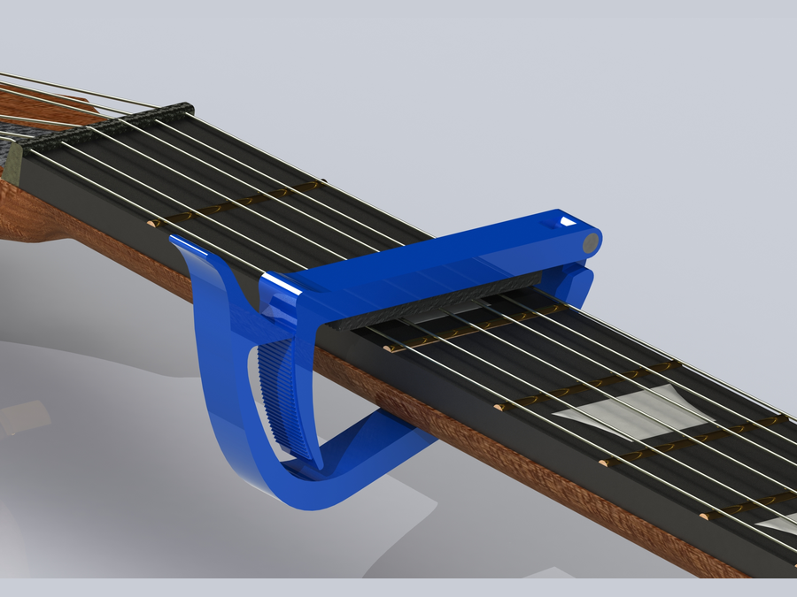
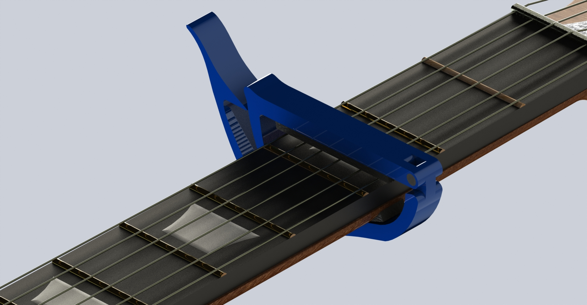
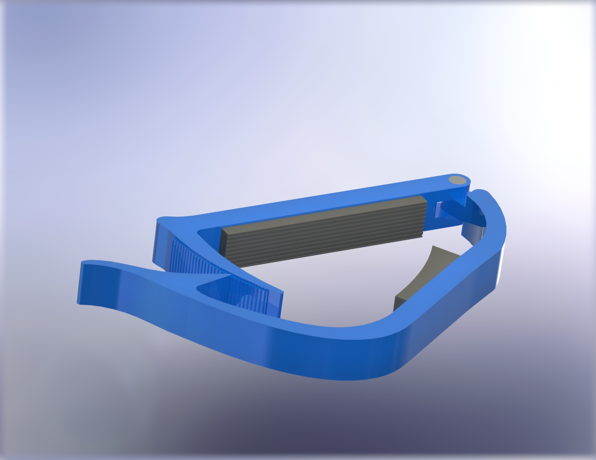
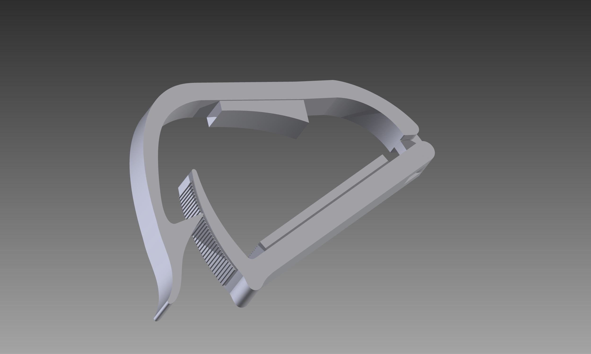
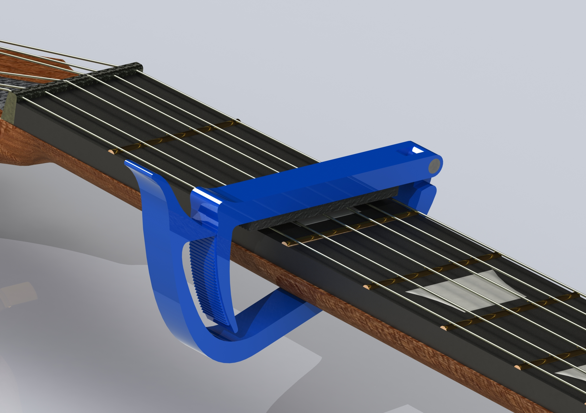
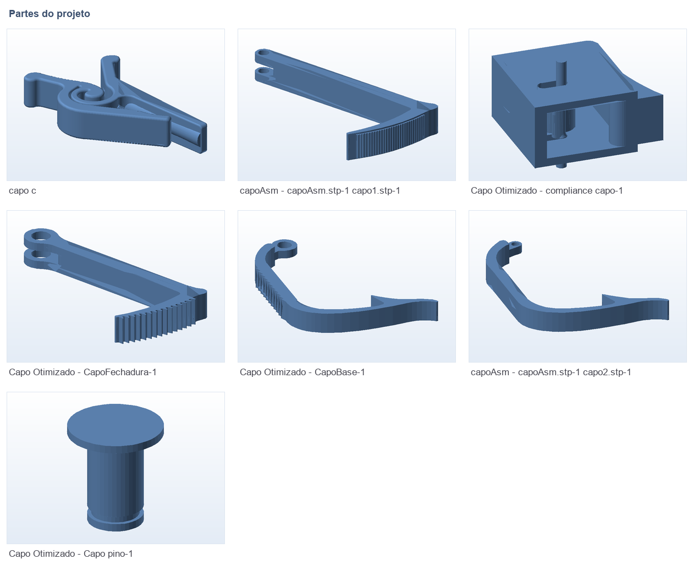

# 🎸 Capotraste (capo) de violão com cremalheira

**O que é:** capotraste (capo) de violão/guitarra com trava por **cremalheira e alavanca de
complacência** — o braço estriado engata na fechadura e mantém a pressão sobre as cordas.
A borracha (`oring` + insertos `ruber1`/`ruber2`) fica entre o corpo e o braço do instrumento
para não marcar a madeira.

**Peças principais:** base, fechadura (cremalheira), alavanca de complacência, pino e o-ring.

## 🖼️ Renderings do CAD

| | |
|---|---|
|  |  |
|  |  |

## 🧩 Partes (render das malhas STL)

## 📁 Arquivos

| Arquivo | O que é |
|---|---|
| `capoAsm.SLDASM` | Montagem principal no SolidWorks |
| `CapoBase.SLDPRT`, `CapoFechadura.SLDPRT`, `compliance capo.SLDPRT`, `Capo_pino.SLDPRT`, `Capo_oring.SLDPRT` | Peças do conjunto |
| `Capo_Otimizado.SLDASM` + `Stl Otimizado/*.STL` | Versão **otimizada para impressão** (5 STLs prontos) |
| `capo1.ipt`, `capo2.ipt`, `fix.ipt`, `ruber1.ipt`, `ruber2.ipt`, `capoAsm.iam` | Primeiras versões em **Autodesk Inventor** |
| `capoAsm.stp`, `.igs`, `.dwg`, `*.x_t` | Exportações neutras (STEP / IGES / Desenho / Parasolid) |
| `capo_c.STL` + `capo_c.fpp` | Variante "C" (malha + projeto fatiado no FlashPrint) |

## 🖨️ Impressão

- Use os STLs de `Stl Otimizado/` — é a versão já revisada para impressão FDM.
- `.fpp` abre no **FlashPrint** (fatiador) e `.gx` é o arquivo pronto para a impressora FlashForge.

---

Imagem principal: rendering do CAD. Demais imagens geradas automaticamente a partir das malhas `.STL`.

[← Voltar ao índice](../README.md) · Licença [CC BY-NC-SA 4.0](../LICENSE)
