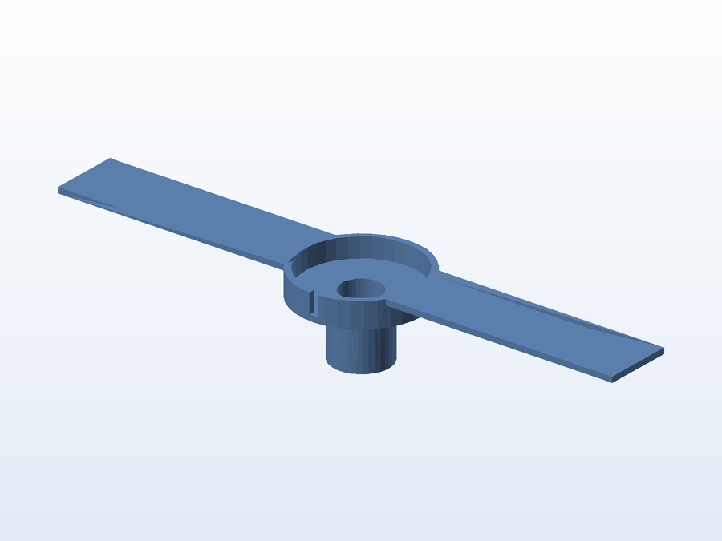

# 🍄 Suporte de flutuador para humidificador (monotub)

**O que é:** suporte que mantém o **flutuador do umidificador** no lugar dentro do reservatório de
um **monotub** (caixa de cultivo). A peça é uma barra com duas abas que se apoiam nas paredes do
reservatório e um anel central que abraça o flutuador, deixando a água circular.

- Peça única, impressa em uma só tiragem.
- Abas longas: distribuem o apoio e evitam que a peça tombe quando o nível da água sobe ou desce.

## 📁 Arquivos

| Arquivo | O que é |
|---|---|
| `Suporte_flutuador_humidificador.SLDPRT` | Projeto editável (SolidWorks) |
| `Suporte_flutuador_humidificador.STL` | Malha pronta para impressão |
| `preview.png` | Render isométrico gerado a partir do STL |

---

Imagem gerada automaticamente a partir da malha `.STL` do projeto (render isométrico, sem textura).

[← Voltar ao índice](../README.md) · Licença [CC BY-NC-SA 4.0](../LICENSE)
