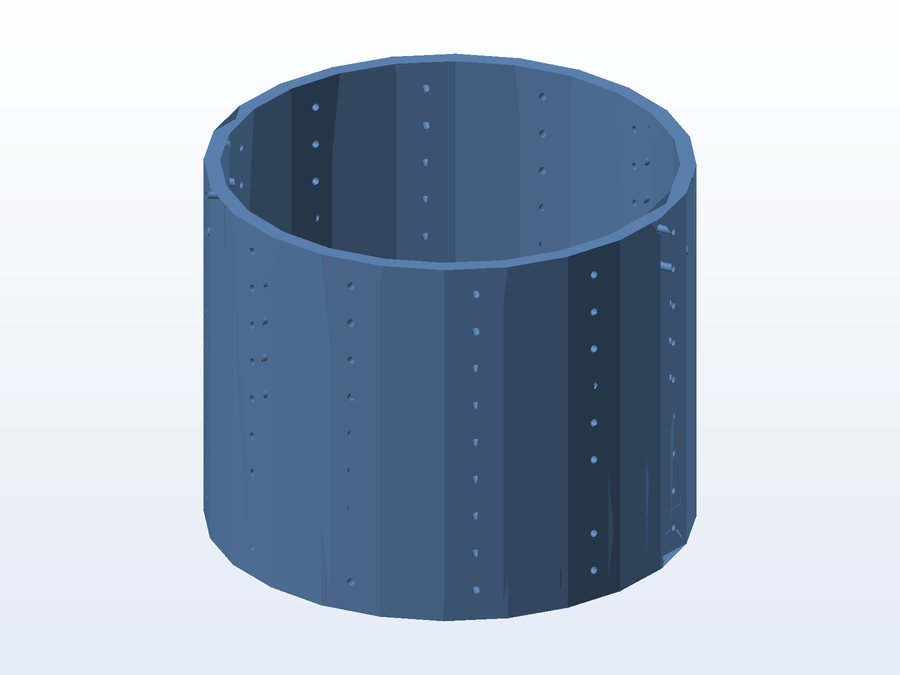
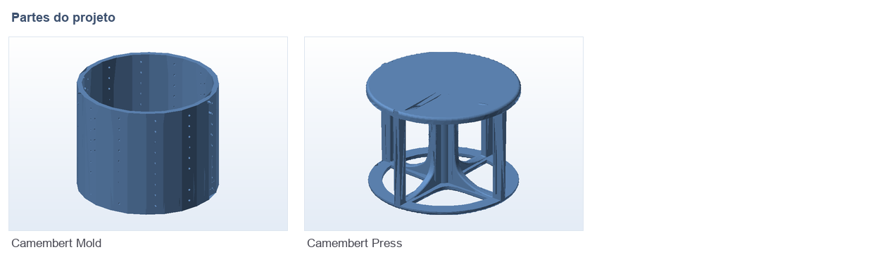

# 🧀 Prensa e molde de queijo Camembert

**O que é:** conjunto para fazer queijo tipo **Camembert** em casa — a **prensa** (projetada no
SolidWorks) aplica pressão na massa coalhada dentro do **molde**, que dá o formato final ao queijo.

## 🧩 Partes (render das malhas)

## 📁 Arquivos

| Arquivo | O que é |
|---|---|
| `Camembert_Press.SLDPRT` | Prensa (projeto editável SolidWorks) |
| `Camembert_Press.STL` | Prensa pronta para impressão |
| `Camembert_Press.fpp` | Projeto fatiado no FlashPrint |
| `Camembert_Press.gx` | Arquivo pronto (FlashForge) — 31 MB, enviado via Git LFS |
| `Camembert_Mold.stl` | Molde (malha escaneada) |
| `Camembert_Mold.gx` | Molde pronto para a impressora (FlashForge, Git LFS) |

## 🖨️ Impressão

- Alimento: imprima em **PETG** ou PLA de grau alimentício, com camadas de 0,16 mm e 4 paredes,
  para a peça ficar estanque e fácil de sanitizar.

---

Imagem gerada automaticamente a partir da malha `.STL` do projeto (render isométrico, sem textura).

[← Voltar ao índice](../README.md) · Licença [CC BY-NC-SA 4.0](../LICENSE)
