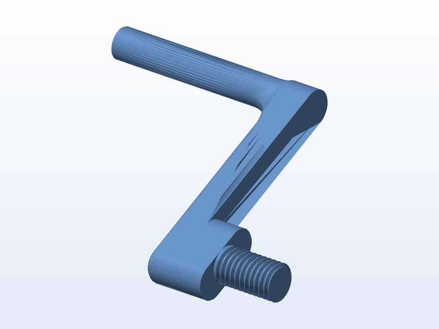
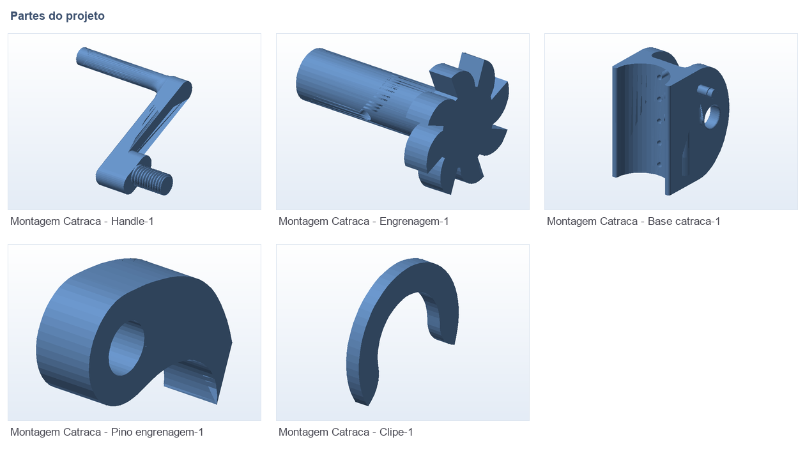

# 🏐 Catraca de rede de vôlei

**O que é:** **esticador com catraca** para a rede de vôlei — o conjunto tensiona o cabo da rede e
trava com engrenagem + pino, sem precisar de nós ou ganchos improvisados.

**Como funciona:** a manivela (`Handle`) gira a `Engrenagem`, o `Pino_engrenagem` trava o sentido de
giro e o `Clipe` prende a `Base catraca` na estrutura/cabo.

## 🧩 Partes

## 📁 Arquivos

| Arquivo | O que é |
|---|---|
| `Montagem Catraca.SLDASM` | Montagem completa (SolidWorks) |
| `Base catraca.SLDPRT` | Corpo/base que fica fixo na estrutura |
| `Engrenagem.SLDPRT` | Engrenagem de tração |
| `Handle.SLDPRT` | Manivela |
| `Pino_engrenagem.SLDPRT` | Pino de trava (mola/engate) |
| `Clipe.SLDPRT` | Clipe de fixação do cabo |
| `STL/*.STL` | As 5 peças prontas para impressão |
| `Montagem Catraca - *.gx` / `.fpp` | Projetos fatiados no FlashPrint (FlashForge, Git LFS) |

## 🖨️ Impressão

- Imprima a `Engrenagem` e o `Handle` com **4+ paredes e 40% de preenchimento** — são as peças
  que recebem a força da tração.

---

Imagem gerada automaticamente a partir da malha `.STL` do projeto (render isométrico, sem textura).

[← Voltar ao índice](../README.md) · Licença [CC BY-NC-SA 4.0](../LICENSE)
