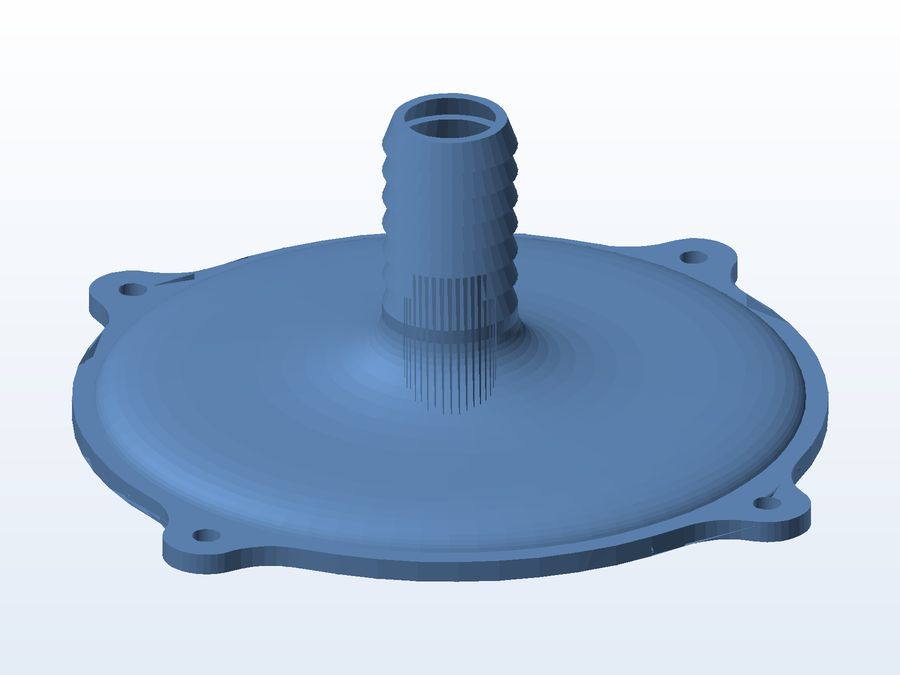
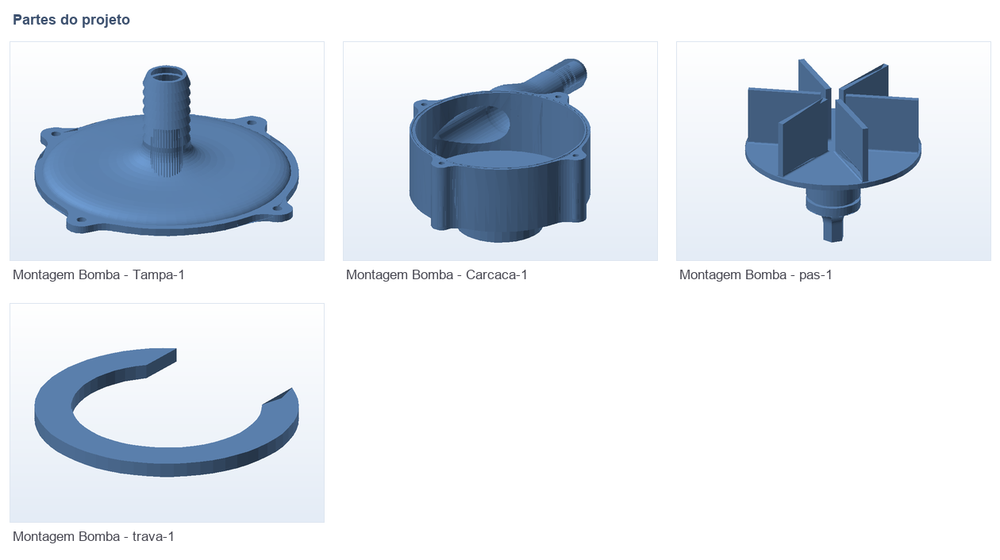

# 💧 Bomba de água impressa em 3D

**O que é:** conjunto de **bomba de água** projetado para impressão 3D e acoplamento em um motor
elétrico: a `Carcaca` aloja o rotor, a `Tampa` fecha a câmara e a `trava` trava a montagem.

**Peças:** carcaça (housing), pás (rotor/impulsor), tampa e trava.

## 🧩 Partes

## 📁 Arquivos

| Arquivo | O que é |
|---|---|
| `Montagem_Bomba.SLDASM` | Montagem completa (SolidWorks) |
| `Carcaca.SLDPRT` | Carcaça / corpo da bomba |
| `pas.SLDPRT` | Rotor com as pás |
| `Tampa.SLDPRT` | Tampa de fechamento |
| `trava.SLDPRT` | Trava da montagem |
| `Stl/*.STL` | As 4 peças prontas para impressão |

## 🖨️ Impressão

- Imprima a carcaça e a tampa com **alta densidade (5+ perímetros)** e, se possível, em **PETG/ABS**
  ou com **pós-processamento** (resina/acetona), para reduzir a porosidade e o vazamento entre camadas.

---

Imagem gerada automaticamente a partir da malha `.STL` do projeto (render isométrico, sem textura).

[← Voltar ao índice](../README.md) · Licença [CC BY-NC-SA 4.0](../LICENSE)
