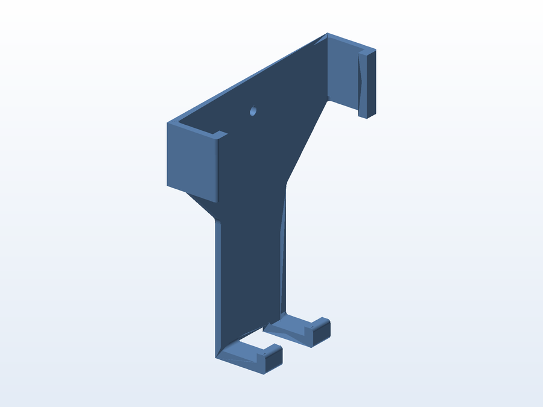
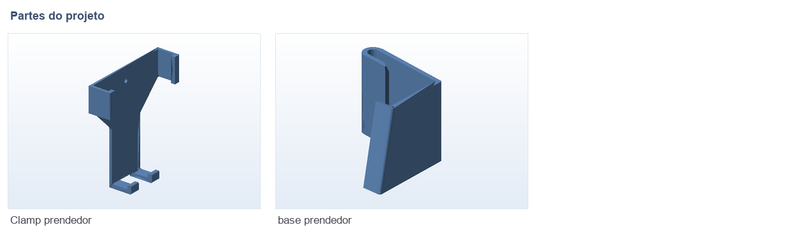

# 📱 Prendedor de celular

**O que é:** prendedor de celular de duas peças: a **base** (`base_prendedor`) e a **garra**
(`Clamp_prendedor`), que se encaixam e prendem o aparelho.

## 🧩 Partes

## 📁 Arquivos

| Arquivo | O que é |
|---|---|
| `base_prendedor.SLDPRT` / `.STL` | Base do prendedor (SolidWorks + malha pronta) |
| `Clamp_prendedor.SLDPRT` / `.STL` | Garra/clamp |
| `Clamp_prendedor.gx` | Projeto fatiado no FlashPrint (FlashForge) |

## 🖨️ Impressão

- Imprima a garra em **PETG** (mais tenaz que o PLA) para as abas flexíveis não trincarem.
- Camadas de 0,16 mm na região de encaixe dão um ajuste mais fino.

---

Imagem gerada automaticamente a partir da malha `.STL` do projeto (render isométrico, sem textura).

[← Voltar ao índice](../README.md) · Licença [CC BY-NC-SA 4.0](../LICENSE)
