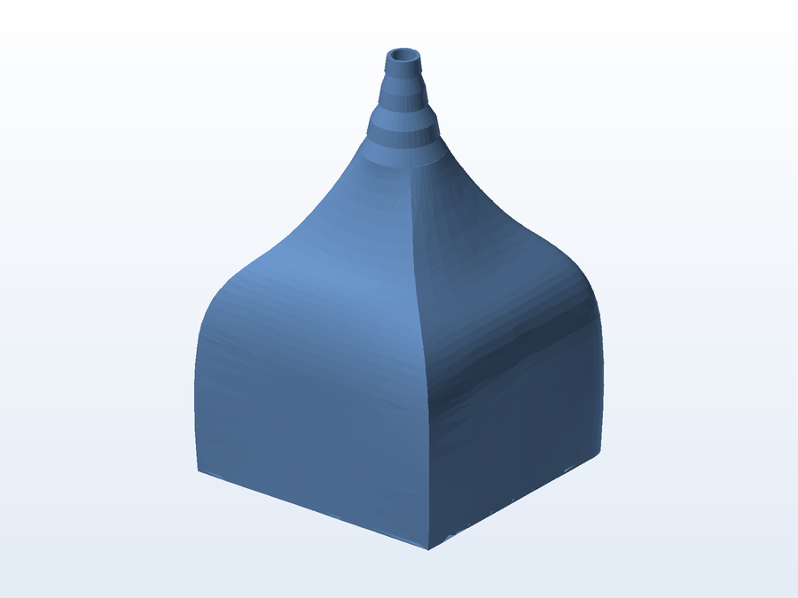
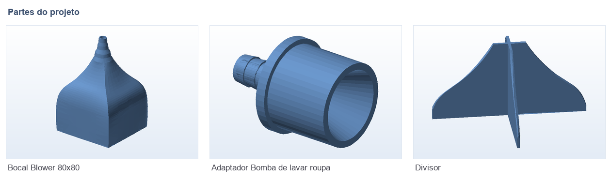

# 🔌 Adaptadores e bocais (bomba, blower e divisor)

**O que é:** três adaptadores avulsos (cada um com projeto SolidWorks + STL + fatiado), mais a
montagem do conjunto do blower:

| Peça | Para que serve |
|---|---|
| `Adaptador_Bomba_de_lavar_roupa` | Adapta a saída/entrada de uma **bomba de máquina de lavar** para mangueira |
| `Bocal_Blower_80x80` | Bocal/difusor para **blower de 80 × 80 mm** (ventilação, secagem ou circulação de ar) |
| `Divisor` | Divisor / distribuidor de fluxo |

## 🧩 Partes

## 📁 Arquivos

| Arquivo | O que é |
|---|---|
| `Montagem Blower.SLDASM` | Montagem do bocal com a estrutura do blower |
| `Adaptador_Bomba_de_lavar_roupa.SLDPRT` / `.STL` / `.gx` | Adaptador da bomba (edição + impressão + fatiado) |
| `Bocal_Blower_80x80.SLDPRT` / `.STL` / `.gx` | Bocal do blower 80 × 80 (o `.gx` tem 17 MB — Git LFS) |
| `Divisor.SLDPRT` / `.STL` / `.gx` | Divisor de fluxo |

## 🖨️ Impressão

- Peças de encaixe em mangueira: imprima com **3–4 perímetros** e tolerância de ~0,2 mm.

---

Imagem gerada automaticamente a partir da malha `.STL` do projeto (render isométrico, sem textura).

[← Voltar ao índice](../README.md) · Licença [CC BY-NC-SA 4.0](../LICENSE)
