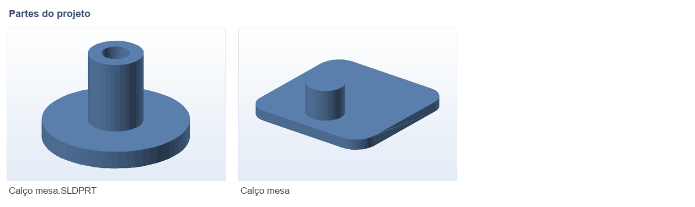

# 🪑 Calço de mesa

**O que é:** calço para **nivelar/estabilizar mesa** (aquela perna que fica no ar e faz a mesa
balançar). Existem **duas versões** da mesma peça no repositório — a original e a reexportada
(`Calço_mesa.SLDPRT.STL`), feita depois de um ajuste no modelo.

## 🧩 Partes

## 📁 Arquivos

| Arquivo | O que é |
|---|---|
| `Calço_mesa.SLDPRT` | Projeto editável (SolidWorks) |
| `Calço_mesa.STL` | Malha principal, pronta para impressão |
| `Calço_mesa.SLDPRT.STL` | Malha reexportada da versão revisada |
| `Calço_mesa.gx` / `Calço_mesa.SLDPRT.gx` | Fatiados no FlashPrint (24 MB e 12 MB — Git LFS) |

## 🖨️ Impressão

- Encha bem (25–40%) e use camadas de 0,2 mm: a peça é estrutural e recebe peso da mesa.

---

Imagem gerada automaticamente a partir da malha `.STL` do projeto (render isométrico, sem textura).

[← Voltar ao índice](../README.md) · Licença [CC BY-NC-SA 4.0](../LICENSE)
