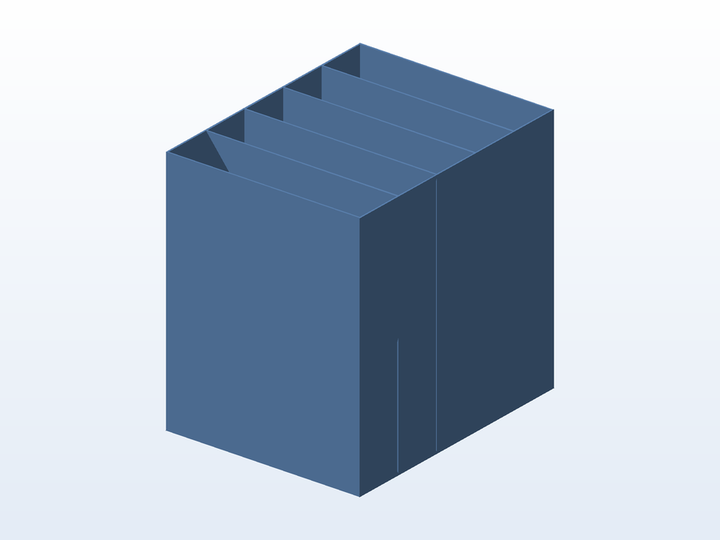

# 💽 Guardador de HD

**O que é:** suporte/berço para **disco rígido (HD)** — mantém o disco apoiado, protegido e
organizado, longe da poeira e de batidas.

## 📁 Arquivos

| Arquivo | O que é |
|---|---|
| `Guardador de HD.SLDPRT` | Projeto editável (SolidWorks) |
| `Guardador de HD.STL` | Malha pronta para impressão |

---

Imagem gerada automaticamente a partir da malha `.STL` do projeto (render isométrico, sem textura).

[← Voltar ao índice](../README.md) · Licença [CC BY-NC-SA 4.0](../LICENSE)
