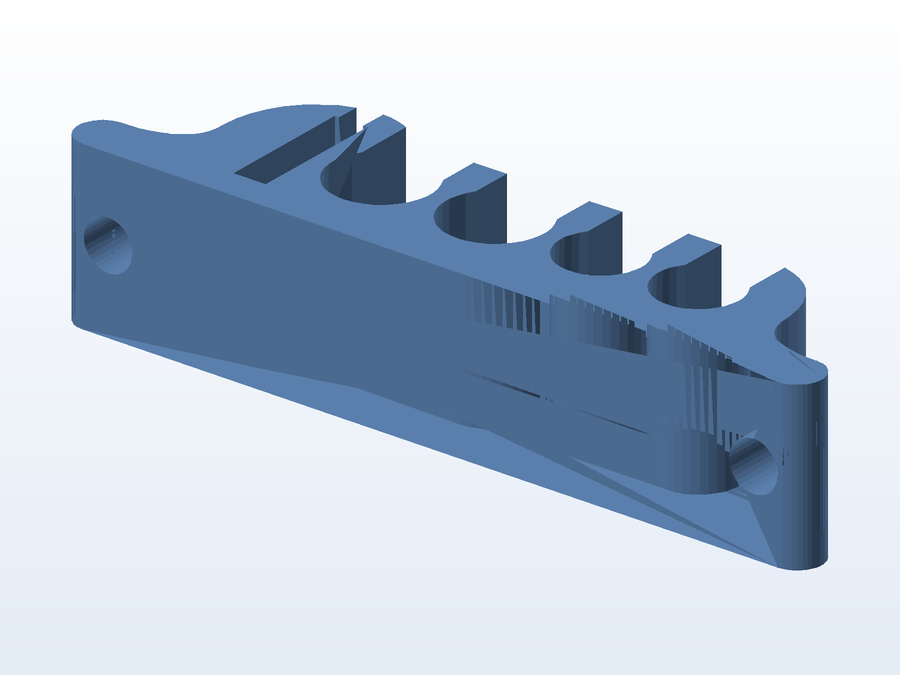

# 🔗 Organizador de cabos

**O que é:** organizador para **agrupar e guiar cabos** (mesa/rack) — os canais alinham os fios e
impedem que fiquem embolados ou caindo atrás do móvel.

## 📁 Arquivos

| Arquivo | O que é |
|---|---|
| `Organizador de Cabos.SLDPRT` | Projeto editável (SolidWorks) |
| `Organizador de Cabos.STL` | Malha pronta para impressão |

---

Imagem gerada automaticamente a partir da malha `.STL` do projeto (render isométrico, sem textura).

[← Voltar ao índice](../README.md) · Licença [CC BY-NC-SA 4.0](../LICENSE)
