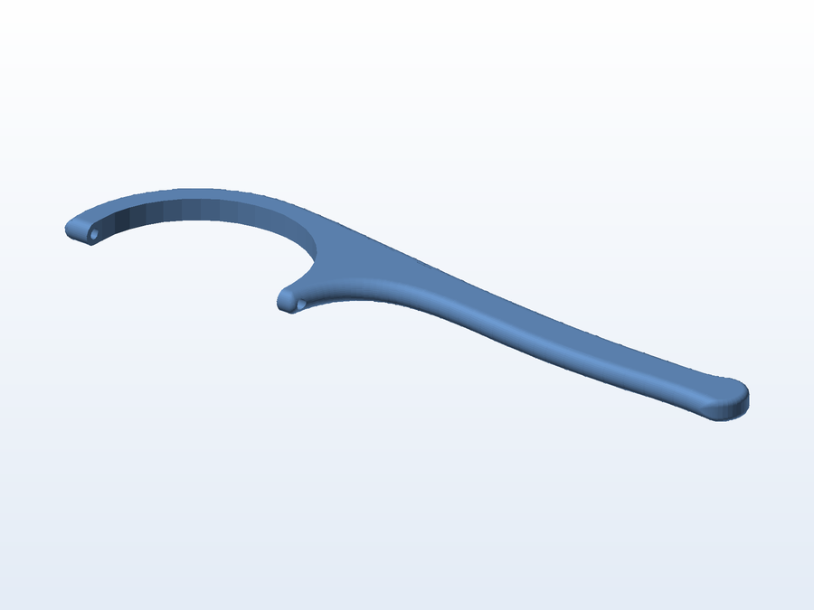

# 🦷 Pegador de fio dental

**O que é:** pegador (aplicador) de **fio dental** — a peça tensiona o fio entre os dois braços e
serve de cabo, útil para quem tem dificuldade de usar o fio direto nos dedos.

## 📁 Arquivos

| Arquivo | O que é |
|---|---|
| `Pegador_Fio_Dental.SLDPRT` | Projeto editável (SolidWorks) |
| `Pegador_Fio_Dental.STL` | Malha pronta para impressão |

## 🖨️ Impressão

- Por ser uma peça de uso pessoal e contato com a boca: imprima em **PETG** e faça uma boa limpeza
  (nada de resíduo de suporte em cantos).

---

Imagem gerada automaticamente a partir da malha `.STL` do projeto (render isométrico, sem textura).

[← Voltar ao índice](../README.md) · Licença [CC BY-NC-SA 4.0](../LICENSE)
