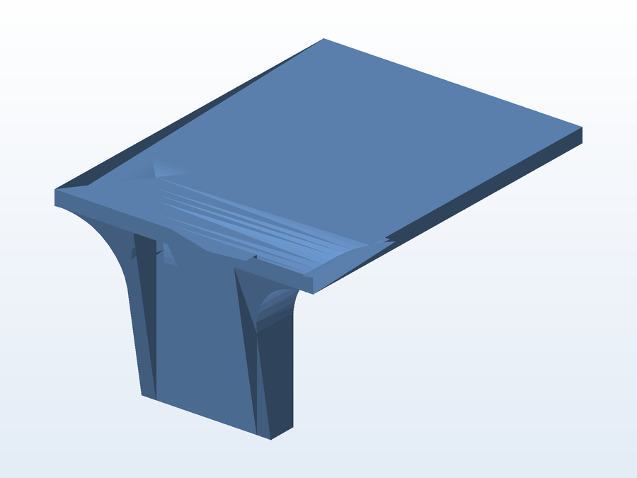

# 🎞️ Suporte de filamento

**O que é:** suporte/guia de **filamento para impressora 3D** — sustenta o carretel e mantém o fio
alinhado na entrada do extrusor, evitando tranças e tração irregular.

## 📁 Arquivos

| Arquivo | O que é |
|---|---|
| `Peça Suporte Filamento.SLDPRT` | Projeto editável (SolidWorks) |
| `Peça Suporte Filamento.STL` | Malha pronta para impressão |

---

Imagem gerada automaticamente a partir da malha `.STL` do projeto (render isométrico, sem textura).

[← Voltar ao índice](../README.md) · Licença [CC BY-NC-SA 4.0](../LICENSE)
