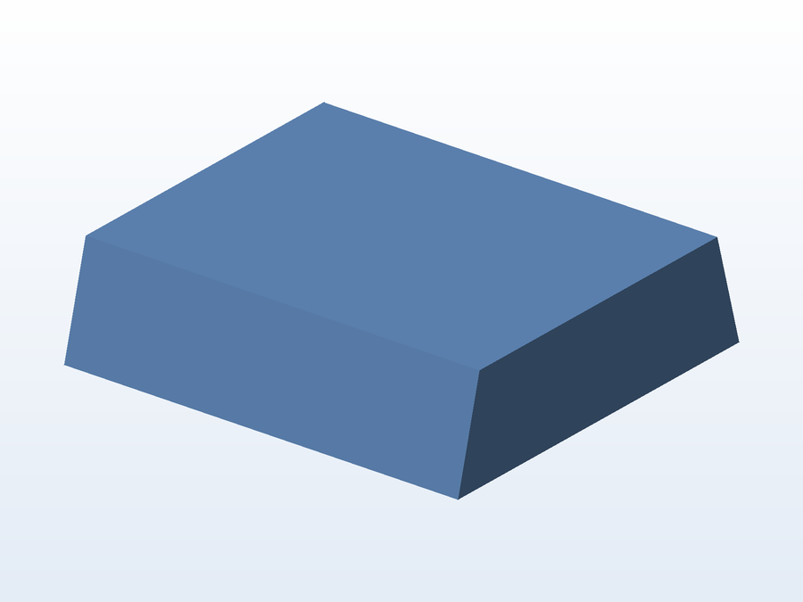

# 📲 Tripé / apoio de celular

**O que é:** peça de apoio para **celular** (versão 2) — um suporte compacto que segura o aparelho
em pé, para gravar ou assistir.

## 📁 Arquivos

| Arquivo | O que é |
|---|---|
| `Peça_tripe_celular_2.SLDPRT` | Projeto editável (SolidWorks) |
| `Peça_tripe_celular_2.STL` | Malha pronta para impressão |
| `Peça_tripe_celular_2.gx` | Projeto fatiado no FlashPrint (FlashForge) |

---

Imagem gerada automaticamente a partir da malha `.STL` do projeto (render isométrico, sem textura).

[← Voltar ao índice](../README.md) · Licença [CC BY-NC-SA 4.0](../LICENSE)
