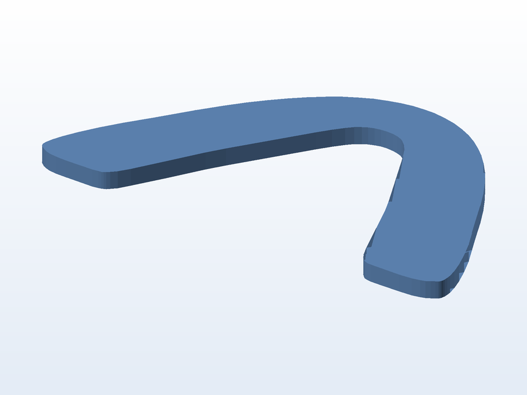
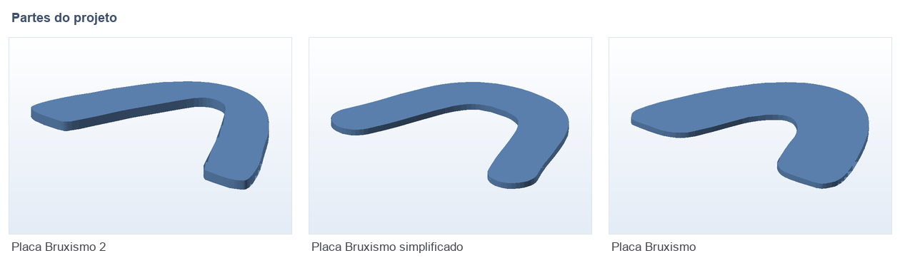

# 😬 Placa para bruxismo (3 versões)

**O que é:** **placa protetora (splint) para bruxismo** — usada à noite para o esmalte dos dentes não
sofrer com o rangido. O desenho é feito a partir da **curva da arcada**, e o formato foi simplificado
ao longo de três tentativas até chegar na versão que ficou confortável.

| Versão | Arquivo | Observação |
|---|---|---|
| Original | `Placa_Bruxismo.STL` | Primeira modelagem |
| Versão 2 | `Placa_Bruxismo_2.STL` | Ajuste de forma/espessura |
| **Simplificada** | `Placa_Bruxismo_simplificado.STL` | Versão final, também fatiada (`Placa_Bruxismo_simplificado.fpp`) |

> A malha de referência da arcada (`UpperJawScan`) está em [`../_diversos`](../_diversos) e foi o
> ponto de partida para essas placas.

## 🧩 Partes

## 📁 Arquivos

| Arquivo | O que é |
|---|---|
| `Placa_Bruxismo.SLDPRT` / `.STL` / `.gx` | Versão original (SolidWorks, malha e fatiado) |
| `Placa_Bruxismo_2.SLDPRT` / `.STL` / `.gx` | Versão 2 |
| `Placa_Bruxismo_simplificado.SLDPRT` / `.STL` / `.fpp` | Versão simplificada + fatiado |

> ⚠️ É um item de uso pessoal/experimental: **não substitui avaliação e indicação odontológica**.

---

Imagem gerada automaticamente a partir da malha `.STL` do projeto (render isométrico, sem textura).

[← Voltar ao índice](../README.md) · Licença [CC BY-NC-SA 4.0](../LICENSE)
