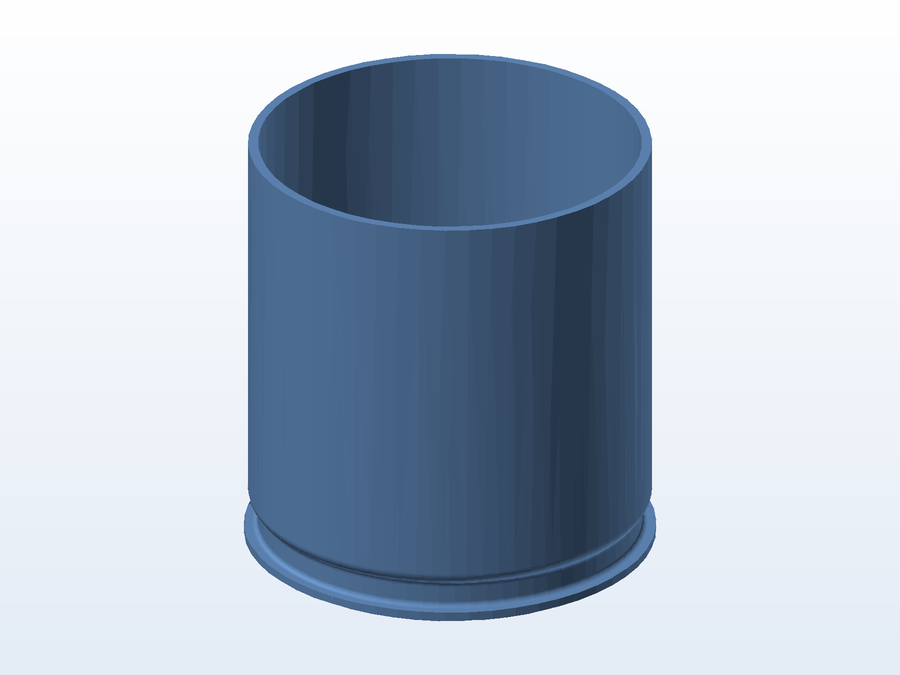

# 🧊 Reservatório isotérmico

**O que é:** **reservatório isotérmico** (caixa/câmara com paredes duplas e isolamento). O trabalho
partiu de malhas digitalizadas (`.gx`) e a **parte inferior em corte** foi a peça exportada para
impressão, para fechar a base do conjunto.

## 📁 Arquivos

| Arquivo | O que é |
|---|---|
| `Reservatório isotérmico 03-interno 02 corte inferior.STL` | Parte inferior em corte, pronta para impressão |
| `Reservatório isotérmico 03-inte.gx` | Malha de trabalho completa — **111 MB** (Git LFS) |
| `Reservatório isotérmico parte d.gx` | Malha parcial `parte d` — **77 MB** (Git LFS) |

> Os `.gx` são grandes porque guardam a **malha densa digitalizada**; por isso são versionados via
> **Git LFS**. O `.STL` leve é o que interessa para imprimir.

---

Imagem gerada automaticamente a partir da malha `.STL` do projeto (render isométrico, sem textura).

[← Voltar ao índice](../README.md) · Licença [CC BY-NC-SA 4.0](../LICENSE)
