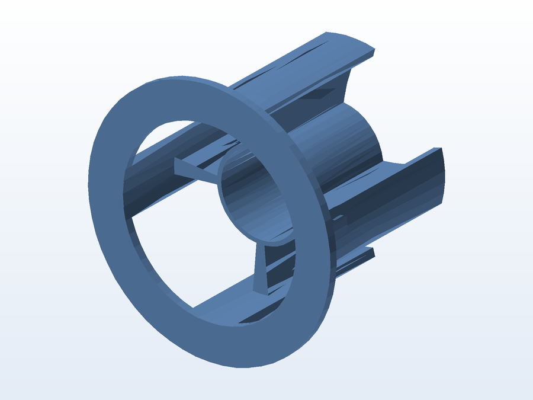

# 🎯 Segurador de rolo de 47 mm

**O que é:** **anel com aletas radiais** que encaixa em um rolo/tubo de **47 mm** e o mantém
centralizado e travado — o rolo não escorrega nem desenrola sozinho. As três/quatro aletas externas
dão o apoio e o furo central recebe o eixo.

## 📁 Arquivos

| Arquivo | O que é |
|---|---|
| `Segurador_Rolo_47mm.SLDPRT` | Projeto editável (SolidWorks) |
| `Segurador_Rolo_47mm.STL` | Malha pronta para impressão |

## 🖨️ Impressão

- Encaixe por interferência leve: **3 perímetros**, 25% de preenchimento e camadas de 0,16 mm.
- Se preferir deslizar suave, imprima em escala 1,005 (0,5% maior) no fatiador.

---

Imagem gerada automaticamente a partir da malha `.STL` do projeto (render isométrico, sem textura).

[← Voltar ao índice](../README.md) · Licença [CC BY-NC-SA 4.0](../LICENSE)
