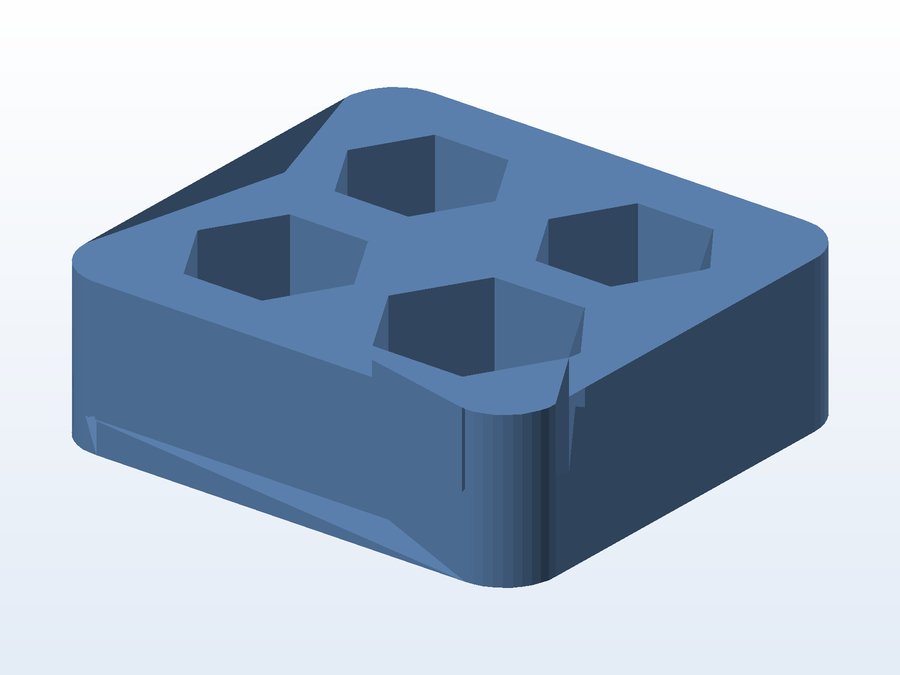

# 📏 Testador de tolerância (tolerance tester)

**O que é:** bloco de **calibração de tolerâncias** para impressão 3D — quatro cavidades de dimensões
diferentes, usadas para descobrir a folga real da sua impressora (retração de material, over/under
extrusion) antes de imprimir uma peça de encaixe.

**Como usar:** imprima o bloco, encaixe um pino/peça de teste em cada cavidade e veja qual encaixa
com o atrito que você quer. A folga da cavidade que ficou "perfeita" é a que você deve aplicar em
projetos práticos (normalmente 0,15–0,30 mm).

## 📁 Arquivos

| Arquivo | O que é |
|---|---|
| `Tolerance_tester.STL` | Malha pronta para impressão (144 KB) |
| `Tolerance_tester.gx` | Projeto fatiado no FlashPrint (FlashForge) |

## 🖨️ Impressão

- Imprima **com o perfil final** (mesma altura de camada e fluxo) que você usa nos seus projetos —
  o objetivo é medir a folga do seu setup, não de um ideal.

---

Imagem gerada automaticamente a partir da malha `.STL` do projeto (render isométrico, sem textura).

[← Voltar ao índice](../README.md) · Licença [CC BY-NC-SA 4.0](../LICENSE)
