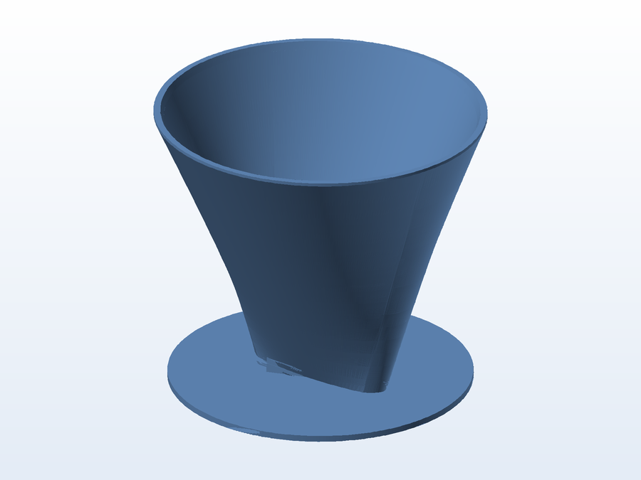

# 🫗 Funil / porta-filtro caseiro

**O que é:** **funil cônico com base de apoio** ("filtro caseiro") — a boca larga recebe o filtro
(papel, pano ou malha) e o disco na base mantém o conjunto em pé sobre o copo ou a garrafa.

## 📁 Arquivos

| Arquivo | O que é |
|---|---|
| `Homemade_Filter.stl` | Malha pronta para impressão (2,7 MB) |

> Esta pasta tem apenas a malha final (não há `.SLDPRT` editável no acervo).

## 🖨️ Impressão

- Para contato com alimento, imprima em **PETG de grau alimentício**, com **4 perímetros** e 0,16 mm
  de camada; dê preferência a bicos de 0,4–0,6 mm para as paredes ficarem estanques.

---

Imagem gerada automaticamente a partir da malha `.STL` do projeto (render isométrico, sem textura).

[← Voltar ao índice](../README.md) · Licença [CC BY-NC-SA 4.0](../LICENSE)
