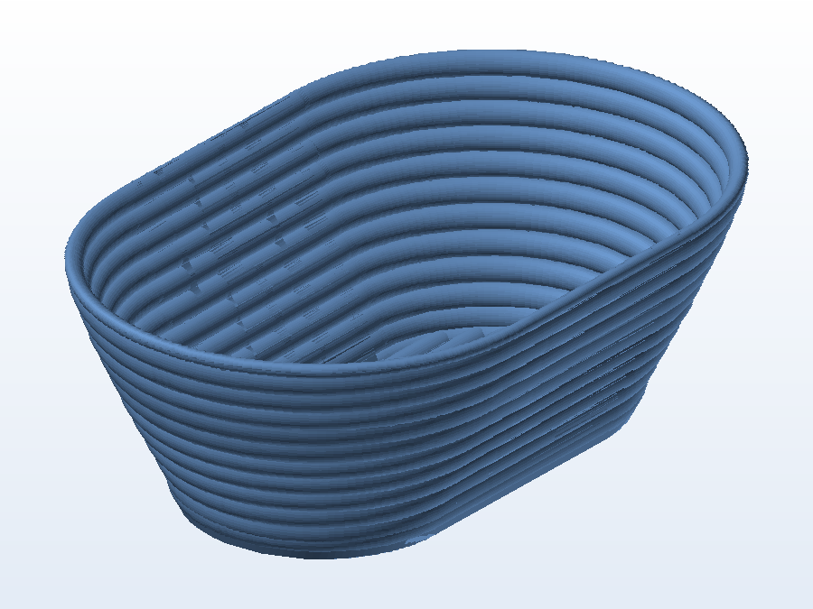

# 🍞 Cesto oval de fermentação (banneton)

**O que é:** cesto **oval de fermentação de pão** (banneton) com paredes em **espiral contínua** —
desenhado para ser impresso em **modo vaso (spiral vase)**, onde a peça sobe em uma única linha sem
costura, deixando a superfície interna com o relevo que marca a massa.

## 📁 Arquivos

| Arquivo | O que é |
|---|---|
| `Bread_Proofing_Baskets-Oval.stl` | Malha pronta para impressão (4,6 MB) |

> Esta pasta tem apenas a malha final (não há `.SLDPRT` editável no acervo).

## 🖨️ Impressão

- No fatiador, ative **Spiral Vase (modo vaso)** e use **1 perímetro, sem preenchimento, sem topo**.
- Camada de **0,24–0,28 mm** com bico de 0,6 mm dá uma parede espessa e resistente.
- Use com um **pano de linho enfarinhado** dentro do cesto — evita que a massa grude.

---

Imagem gerada automaticamente a partir da malha `.STL` do projeto (render isométrico, sem textura).

[← Voltar ao índice](../README.md) · Licença [CC BY-NC-SA 4.0](../LICENSE)
