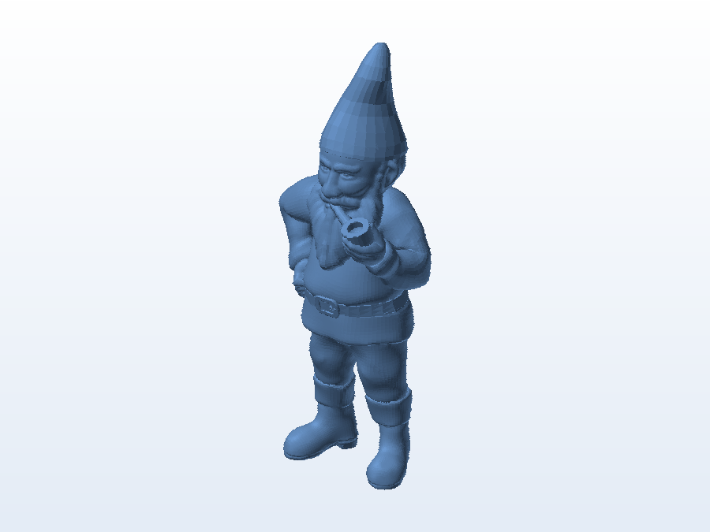

# 🧙 Gnomo de jardim

**O que é:** gnomo de jardim com cachimbo — peça decorativa. O acervo guarda a **malha pronta**
(`.obj`), no tamanho maior, junto do **projeto fatiado** (`.gx`) já preparado para a impressora.

## 📁 Arquivos

| Arquivo | O que é |
|---|---|
| `19378_Garden_gnome_with_pipe_in_mouth_v1_NEW.obj` | Malha pronta (8,6 MB) |
| `19378_Garden_gnome_with_pipe_in_m.gx` | Projeto fatiado no FlashPrint (18 MB — Git LFS) |

> Arquivo de referência para impressão: **não há `.SLDPRT` editável** desta peça no acervo.

## 🖨️ Impressão

- Peça alta e fina (chapéu): use **suportes na barba/cachimbo** e considere cortar em duas partes com
  pinos de encaixe, se a sua impressora não tiver altura suficiente.
- Camadas de 0,16 mm deixam os detalhes do rosto bem definidos.

---

Imagem gerada automaticamente a partir da malha `.obj` do projeto (render isométrico, sem textura).

[← Voltar ao índice](../README.md) · Licença [CC BY-NC-SA 4.0](../LICENSE)
