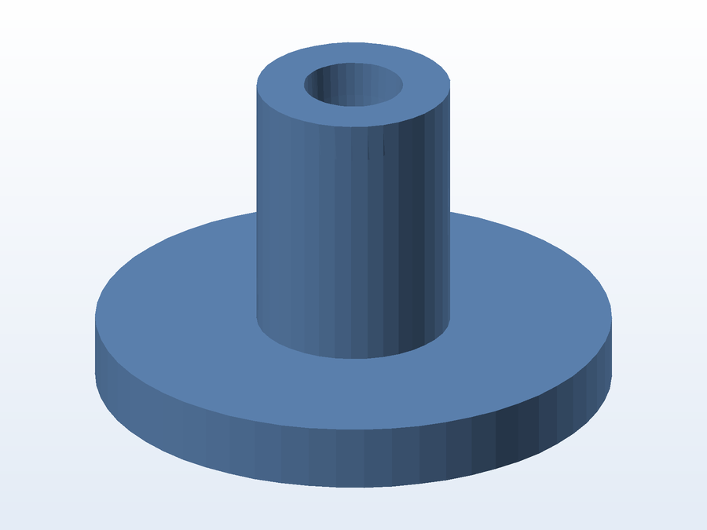

# 🏠 Projetos para Casa — Modelos 3D

Peças que projetei para resolver necessidades de casa: organização, manutenção, acessórios e
utensílios. Modeladas no **SolidWorks** (algumas com a primeira versão em **Autodesk Inventor**),
todas com **STL pronto para impressão** e, quando deu certo, o **projeto fatiado** (`.gx`/`.fpp`)
que realmente foi usado na impressora.

**21 pastas:** 20 modelagens + 1 pasta de arquivos diversos — cada uma com **foto, descrição e
recomendações de impressão** no próprio README.

---

## 📦 Índice dos projetos

> Clique na imagem para abrir a pasta com a descrição completa, a lista de arquivos e as dicas de impressão.

<table>
<tr>
<td align="center" width="33%">
<a href="01-rack-capo/"></a><br>
<a href="01-rack-capo/"><b>🎸 Capotraste de violão</b></a><br>
<sub>cremalheira, fechadura, o-ring e borrachas</sub>
</td>
<td align="center" width="33%">
<a href="02-monotub/"></a><br>
<a href="02-monotub/"><b>🍄 Suporte de flutuador</b></a><br>
<sub>umidificador do tub de cultivo</sub>
</td>
<td align="center" width="33%">
<a href="03-molde-queijo-camembert/"></a><br>
<a href="03-molde-queijo-camembert/"><b>🧀 Prensa e molde de queijo</b></a><br>
<sub>Camembert caseiro</sub>
</td>
</tr>
<tr>
<td align="center" width="33%">
<a href="04-catraca-de-volei/"></a><br>
<a href="04-catraca-de-volei/"><b>🏐 Catraca de rede de vôlei</b></a><br>
<sub>engrenagem, pino, manivela e clipe</sub>
</td>
<td align="center" width="33%">
<a href="05-bomba-de-agua/"></a><br>
<a href="05-bomba-de-agua/"><b>💧 Bomba de água</b></a><br>
<sub>carcaça, rotor, tampa e trava</sub>
</td>
<td align="center" width="33%">
<a href="06-prendedor-de-celular/"></a><br>
<a href="06-prendedor-de-celular/"><b>📱 Prendedor de celular</b></a><br>
<sub>base + garra</sub>
</td>
</tr>
<tr>
<td align="center" width="33%">
<a href="07-adaptadores-de-cerveja/"></a><br>
<a href="07-adaptadores-de-cerveja/"><b>🔌 Adaptadores e bocais</b></a><br>
<sub>bomba de lavar roupa, blower 80×80 e divisor</sub>
</td>
<td align="center" width="33%">
<a href="08-calco-de-mesa/"></a><br>
<a href="08-calco-de-mesa/"><b>🪑 Calço de mesa</b></a><br>
<sub>para a mesa que balança (2 versões)</sub>
</td>
<td align="center" width="33%">
<a href="09-guardador-de-hd/"></a><br>
<a href="09-guardador-de-hd/"><b>💽 Guardador de HD</b></a><br>
<sub>berço com nervuras</sub>
</td>
</tr>
<tr>
<td align="center" width="33%">
<a href="10-organizador-de-cabos/"></a><br>
<a href="10-organizador-de-cabos/"><b>🔗 Organizador de cabos</b></a><br>
<sub>barra com 5 canais em U</sub>
</td>
<td align="center" width="33%">
<a href="11-pegador-de-fio-dental/"></a><br>
<a href="11-pegador-de-fio-dental/"><b>🦷 Pegador de fio dental</b></a><br>
<sub>aplicador com dois braços</sub>
</td>
<td align="center" width="33%">
<a href="12-suporte-de-filamento/"></a><br>
<a href="12-suporte-de-filamento/"><b>🎞️ Suporte de filamento</b></a><br>
<sub>carretel da impressora 3D</sub>
</td>
</tr>
<tr>
<td align="center" width="33%">
<a href="13-tripe-de-celular/"></a><br>
<a href="13-tripe-de-celular/"><b>📲 Tripé / apoio de celular</b></a><br>
<sub>suporte compacto</sub>
</td>
<td align="center" width="33%">
<a href="14-placa-de-bruxismo/"></a><br>
<a href="14-placa-de-bruxismo/"><b>😬 Placa para bruxismo</b></a><br>
<sub>3 versões modeladas</sub>
</td>
<td align="center" width="33%">
<a href="15-reservatorio-isotermico/"></a><br>
<a href="15-reservatorio-isotermico/"><b>🧊 Reservatório isotérmico</b></a><br>
<sub>parte inferior em corte</sub>
</td>
</tr>
<tr>
<td align="center" width="33%">
<a href="16-segurador-de-rolo-47mm/"></a><br>
<a href="16-segurador-de-rolo-47mm/"><b>🎯 Segurador de rolo 47 mm</b></a><br>
<sub>anel com aletas radiais</sub>
</td>
<td align="center" width="33%">
<a href="17-testador-de-tolerancia/"></a><br>
<a href="17-testador-de-tolerancia/"><b>📏 Testador de tolerância</b></a><br>
<sub>calibrar encaixes da impressora</sub>
</td>
<td align="center" width="33%">
<a href="18-filtro-caseiro/"></a><br>
<a href="18-filtro-caseiro/"><b>🫗 Funil / porta-filtro</b></a><br>
<sub>cone com base de apoio</sub>
</td>
</tr>
<tr>
<td align="center" width="33%">
<a href="19-cesto-de-fermentacao/"></a><br>
<a href="19-cesto-de-fermentacao/"><b>🍞 Cesto oval de fermentação</b></a><br>
<sub>banneton em modo vaso</sub>
</td>
<td align="center" width="33%">
<a href="20-gnomo-de-jardim/"></a><br>
<a href="20-gnomo-de-jardim/"><b>🧙 Gnomo de jardim</b></a><br>
<sub>malha + projeto fatiado</sub>
</td>
<td align="center" width="33%">
<a href="_diversos/"></a><br>
<a href="_diversos/"><b>🗂️ Diversos</b></a><br>
<sub>escaneamento da arcada + estudos</sub>
</td>
</tr>
</table>

---

## 🧭 Como cada pasta está organizada

```
01-rack-capo/
├── README.md          <- explicação do projeto + dicas de impressão
├── preview.png        <- imagem principal (esta aparece no índice acima)
├── partes.png         <- folha de contato com todas as peças (quando há mais de uma)
├── *.SLDPRT/.SLDASM   <- projeto editável (SolidWorks)
├── *.STL              <- malha pronta para imprimir
└── *.gx/.fpp          <- projeto já fatiado (FlashPrint)
```

## 🖨️ Formatos de arquivo

| Formato | Para que serve |
|---|---|
| `.SLDPRT` / `.SLDASM` | Abrir e editar no **SolidWorks** (peça e montagem) |
| `.STL` / `.OBJ` | Imprimir — o GitHub mostra o **visualizador 3D** ao clicar no arquivo |
| `.gx` | Trabalho/projeto pronto da **FlashForge** (FlashPrint) |
| `.fpp` | Projeto do fatiador **FlashPrint** |
| `.ipt` / `.iam` | Primeiras versões em **Autodesk Inventor** |
| `.stp` / `.igs` / `.x_t` / `.dwg` | Exportações neutras (STEP / IGES / Parasolid / desenho técnico) |

## 🖼️ Sobre as imagens

Os renders são gerados automaticamente **a partir das próprias malhas** — script caseiro em
Python + Pillow, publicado em [`_ferramentas/`](_ferramentas) junto com as instruções. A única
exceção é o capotraste, que tem **renderings do CAD** feitos no SolidWorks/Inventor.

## 📄 Licença

[CC BY-NC-SA 4.0](LICENSE) — pode usar, imprimir, adaptar e compartilhar **dando o crédito**,
**sem fins comerciais** e **mantendo a mesma licença**.

---

<sub>Parte do acervo de modelagem de [**@educapeta**](https://github.com/educapeta).</sub>

