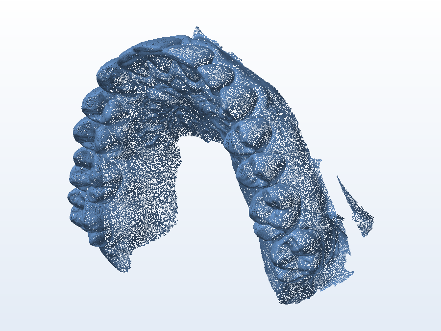

# 🗂️ Diversos — escaneamento e estudos

Arquivos que **não são uma modelagem de utilidade** como as outras pastas, mas que ficam guardados
junto do acervo: o escaneamento que serviu de base e alguns estudos de modelagem.

## 📁 Arquivos

| Arquivo | O que é |
|---|---|
| `UpperJawScan.stl` / `.gx` | **Escaneamento da maxila superior** (arcada dentária) — malha densa (22 MB) usada como referência para as [placas](../14-placa-de-bruxismo) |
| `1_2_carro.SLDPRT` | Estudo de modelagem (metade de carro) |
| `Simplificado.SLDPRT` | Versão simplificada, usada em testes |
| `Teste.SLDPRT` | Arquivo de teste/experimento do SolidWorks |

> São arquivos de trabalho — o `.STL` herdado do escaneamento tem cerca de **450 mil triângulos**,
> então é pesado para fatiar sem antes reduzir a malha.

---

Imagem: render da malha de escaneamento (isométrico, sem textura).

[← Voltar ao índice](../README.md) · Licença [CC BY-NC-SA 4.0](../LICENSE)
